# SouTracking — Estado Atual da Plataforma

## 1. Resumo executivo
O SouTracking é a plataforma de rastreamento e operação da SouInova, reunindo monitoramento, atendimento, chamados, relatórios, câmeras, estoque e inteligência operacional em uma única experiência.

## 2. Visão geral
A plataforma foi pensada para:
- acompanhar veículos em tempo real;
- reduzir trabalho manual da operação;
- centralizar atendimento e suporte;
- abrir chamados operacionais;
- gerar visão executiva;
- preparar integração com SouCall e SouFind;
- facilitar expansão para clientes e parceiros.

## 3. Telas e função de cada uma

### Login
Função:
Tela de entrada da plataforma, com identidade visual SouTracking.

Valor:
Mostra o acesso centralizado e profissional para clientes, operadores e gestores.

### Dashboard
Função:
Painel principal com visão geral da operação.

Valor:
Permite ver rapidamente status da frota, alertas, indicadores e pontos críticos.

### Mapa
Função:
Tela principal de rastreamento em tempo real.

Valor:
Mostra veículos no mapa, localização, status, velocidade, última comunicação e detalhes operacionais.

### Veículos
Função:
Consulta e gestão dos veículos cadastrados.

Valor:
Permite visualizar dados do veículo, identificador, status, última comunicação e informações operacionais.

### Rotas
Função:
Consulta de histórico de deslocamento.

Valor:
Ajuda a entender trajetos, períodos, movimentação e comportamento operacional dos veículos.

### Alertas
Função:
Central de eventos e ocorrências da operação.

Valor:
Organiza alertas como sem comunicação, ignição, cerca, velocidade, pânico e situações críticas.

### Cercas
Função:
Gestão de áreas de controle no mapa.

Valor:
Permite criar áreas de entrada, saída, risco, operação, residência, base ou região monitorada.

### Relatórios
Função:
Geração de relatórios operacionais.

Valor:
Ajuda gestores a acompanhar rotas, eventos, veículos, produtividade, ocorrências e indicadores.

### Configurações
Função:
Área de administração da plataforma.

Valor:
Permite organizar usuários, permissões, dispositivos, grupos, motoristas, notificações e parâmetros da operação.

### Demo Telemetria
Função:
Demonstração avançada de telemetria.

Valor:
Mostra a capacidade do SouTracking de exibir dados avançados, eventos no mapa, análise visual e relatórios técnicos.

### MDVR / Câmeras
Função:
Área visual para câmeras veiculares e evidências.

Valor:
Mostra como o sistema pode evoluir para cruzar vídeo, rastreamento, alerta e ocorrência.

### Estoque
Função:
Controle de rastreadores, chips, acessórios e movimentações.

Valor:
Ajuda a controlar equipamentos disponíveis, instalados, em manutenção, em posse de técnicos e vinculados a veículos.

### IA Operacional
Função:
Assistente operacional para apoiar decisões e criar ações.

Valor:
Permite criar alertas, cercas, relatórios, chamados e sugestões operacionais com mais velocidade.

### Comunicação
Função:
Área de atendimento integrada ao SouCall.

Valor:
Permite centralizar conversas, avisos, suporte, mensagens para cliente, motorista e operação.

### Chamados
Função:
Área de abertura e acompanhamento de chamados operacionais.

Valor:
Permite transformar ocorrências em atendimento, suporte, manutenção, instalação, vistoria ou assistência pelo SouFind.

## 4. O que já está funcional
- plataforma abre;
- login validado;
- dashboard navegável;
- mapa funcional;
- veículos funcionando;
- rotas com consulta estruturada;
- alertas estruturados;
- telemetria demo pronta;
- MDVR demo visual;
- estoque demo visual;
- menus principais criados;
- identidade SouTracking aplicada.

## 5. O que está parcial
- algumas telas ainda estão em estrutura visual;
- alguns dados dependem de massa real;
- relatórios e cercas precisam de refinamento;
- MDVR e estoque ainda estão em modo demonstração;
- Comunicação e Chamados serão conectados ao SouCall e SouFind.

## 6. Próximos passos
1. Finalizar funções reais de rastreamento.
2. Padronizar visual de todos os menus.
3. Conectar Comunicação ao SouCall.
4. Conectar Chamados ao SouFind.
5. Refinar relatórios executivos.
6. Preparar apresentação comercial para clientes.

## 7. Mensagem final para o André
“O objetivo agora não é vender uma tela bonita. É consolidar uma plataforma operacional que reduz trabalho manual, centraliza atendimento, organiza chamados e transforma rastreamento em inteligência de operação.”

---

## 8. Capturas das telas

### 01. Login
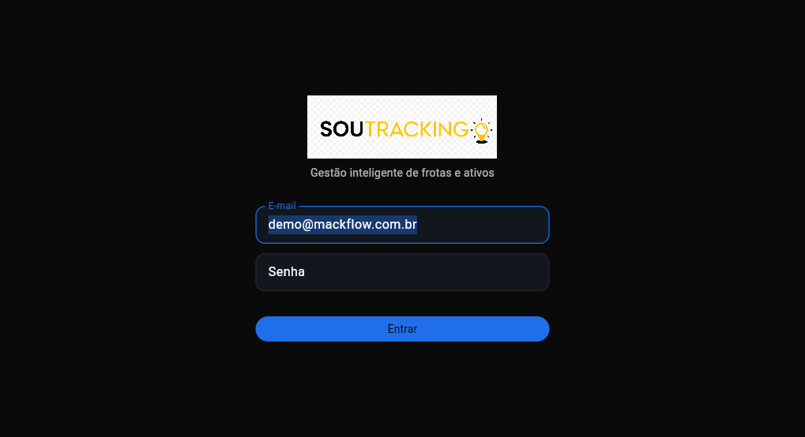

### 02. Dashboard
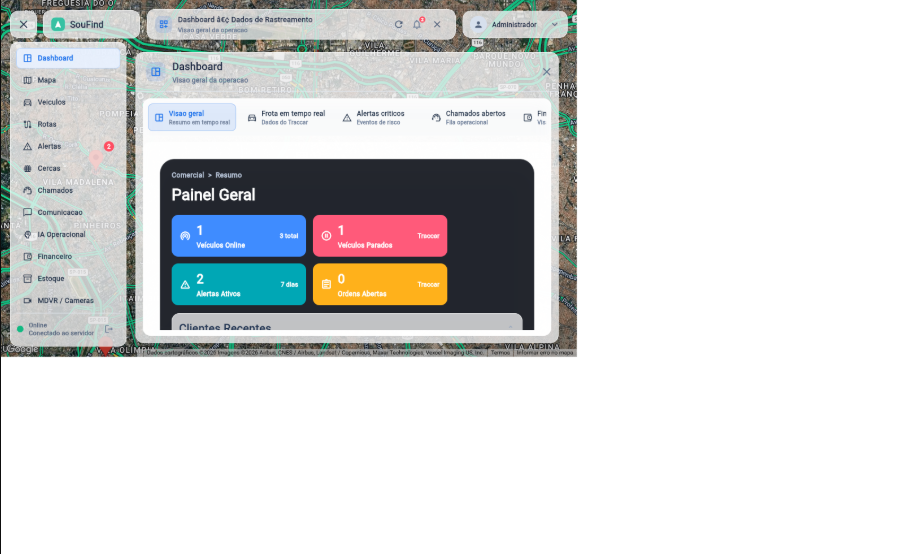

### 03. Mapa
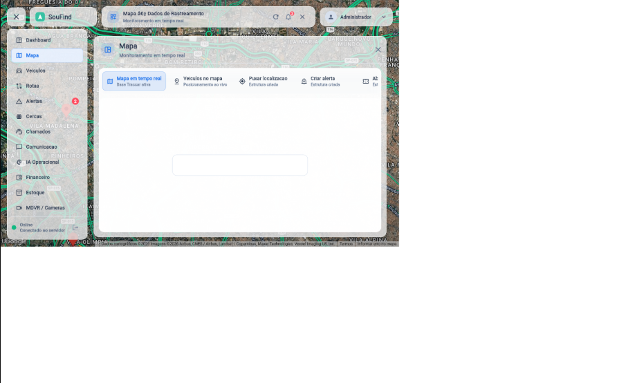

### 04. Veiculos
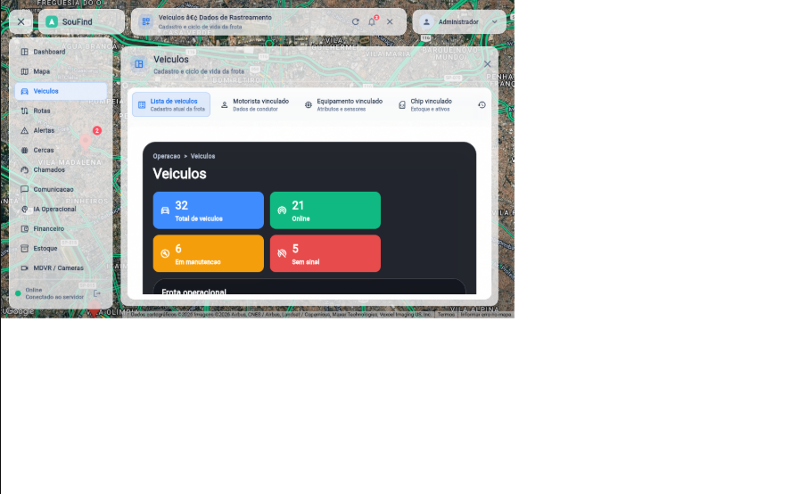

### 05. Rotas
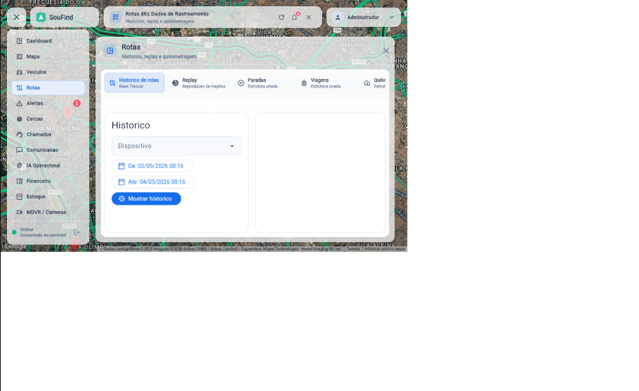

### 06. Alertas
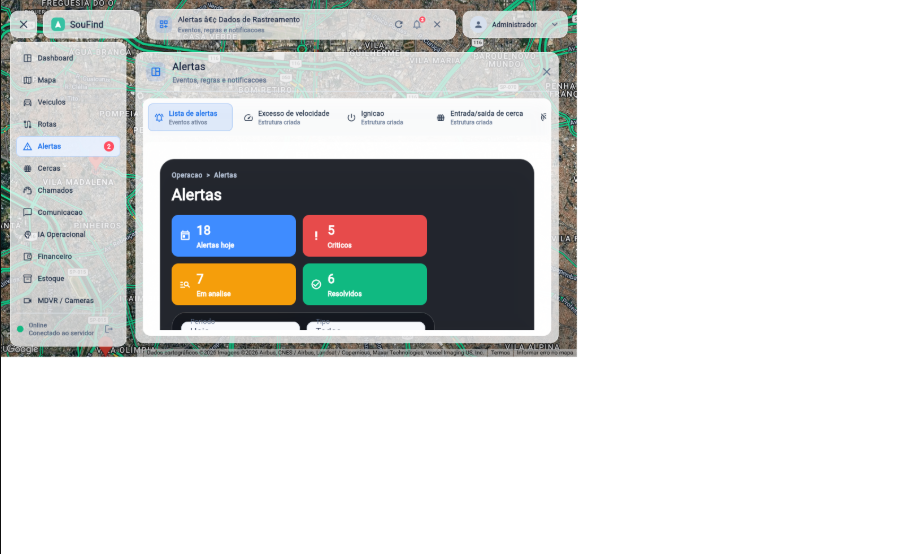

### 07. Cercas
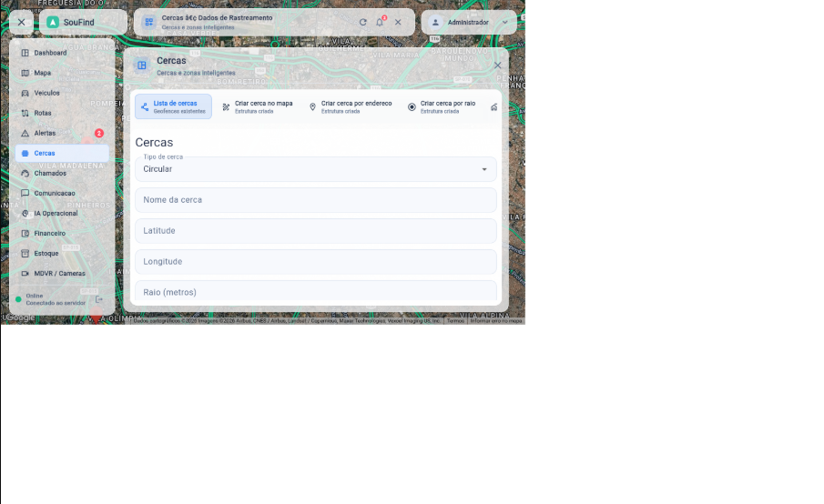

### 08. Relatorios

### 09. Configuracoes
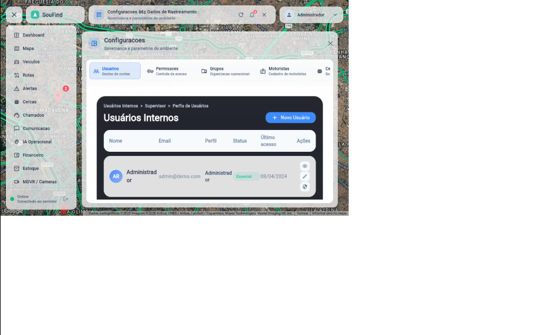

### 10. Demo Telemetria
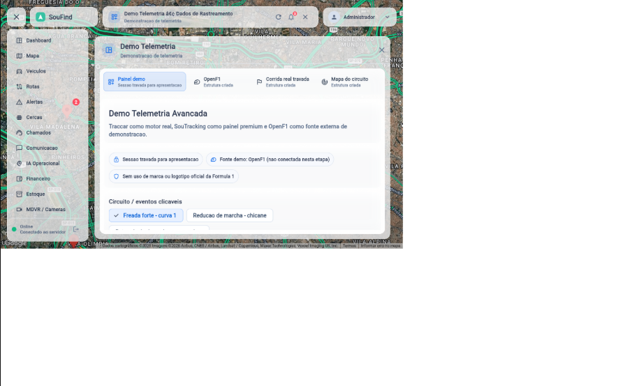

### 11. MDVR / Cameras
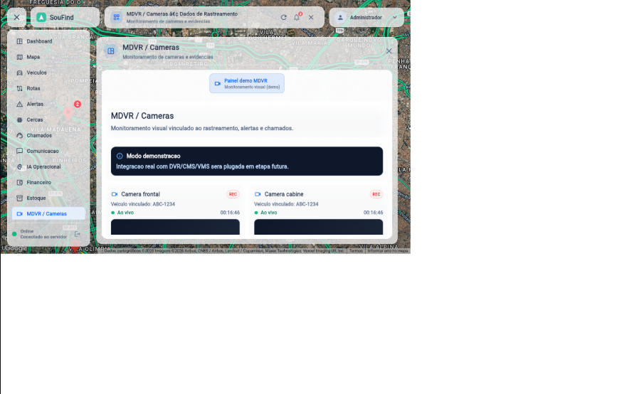

### 12. Estoque
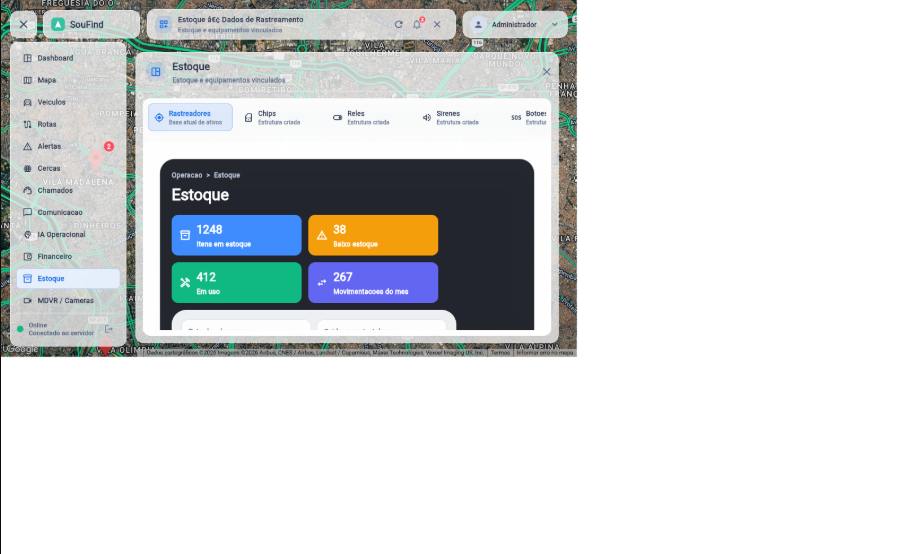

### 13. IA Operacional
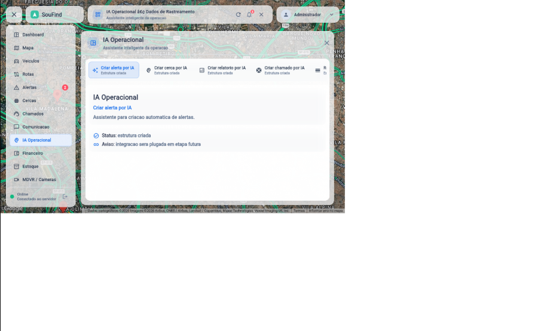

### 14. Comunicacao
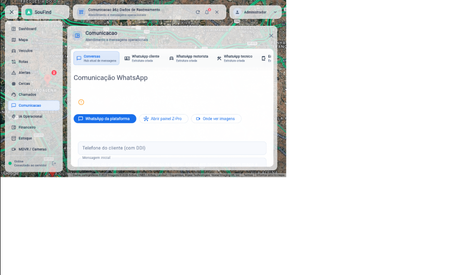

### 15. Chamados
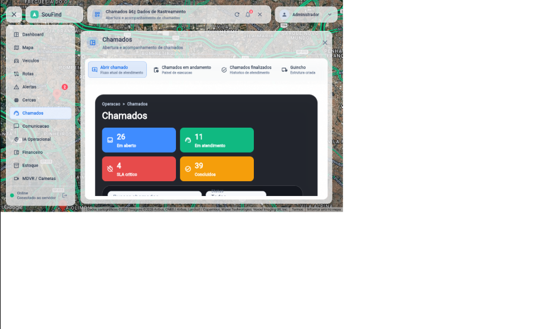
